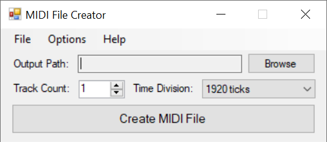

# MIDI File Creator

Overview
------------

MIDI File Creator is an extremely simple and lightweight program that creates empty MIDI files with a custom number of tracks and time division.

Usage
------------

1. Click the "Browse" button next to the box labeled "Output Path:" and enter in the desired name for the output MIDI file to be saved under.

2. Enter the desired number of tracks the output MIDI will contain (1 - 65535) in the box labeled "Track Count:"

3. Select the desired time division the output MIDI will be from the drop down list labeled "Time Division:" (If unsure, choose 1920 ticks).

4. **Optional:** In the options menu, you can select whether or not to add a SysEx reset message at the beginning of each track (General MIDI, Roland GS, and Yamaha XG are currently supported).

5. When finished configuring, click the "Create MIDI File" button to create the MIDI file.

Limitations
------------

- Can only create MIDI files under the MIDI 1.0 specification
- SysEx reset messages for General MIDI, Roland GS, and Yamaha XG are the only SysEx messages the program currently supports

References
------------

To learn more about the MIDI 1.0 specification, visit the links below:
- MIDI File Format Specifications: https://github.com/colxi/midi-parser-js/wiki/MIDI-File-Format-Specifications
- The MIDI File Format: https://www.csie.ntu.edu.tw/~r92092/ref/midi/
